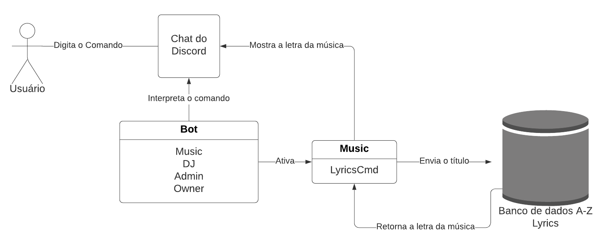
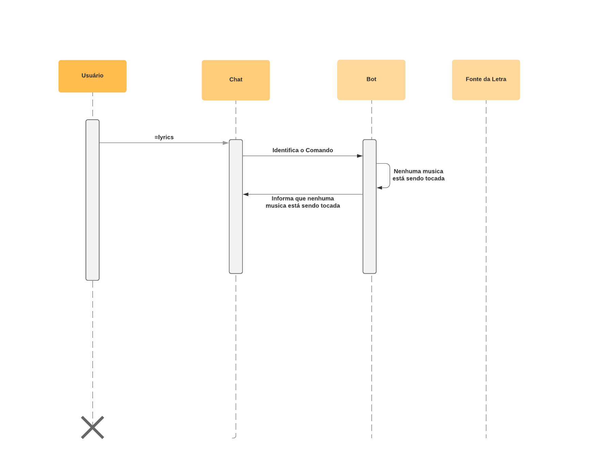
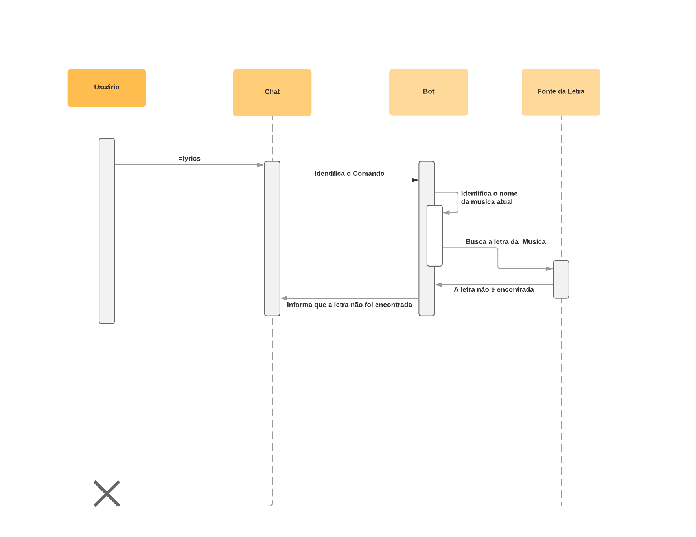
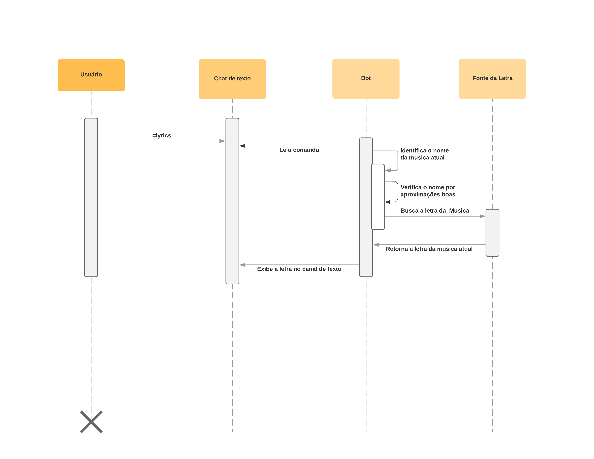
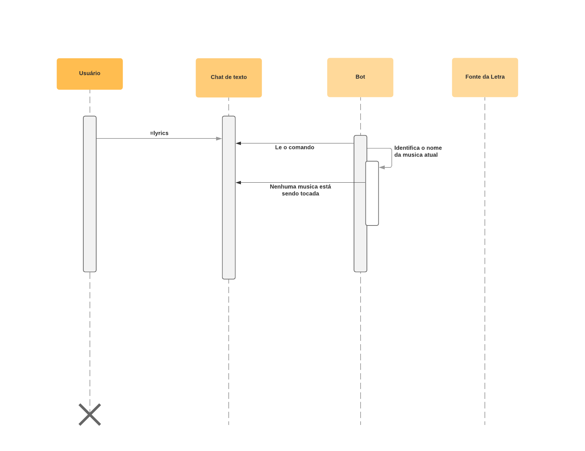

## Esboço da Arquitetura de Software

Uma das propostas do projeto é a adição de uma busca padrão de letra de música.
Ao digitar o comando "lyrics" o software deve mostrar a letra da música que está tocando atualmente mesmo que não seja identificado seu nome.

## Diagrama de Classe Issue #1

## Diagrama de Sequência Issue #1

## Diagrama de Sequência Erro 1 Issue #1

Erro que ocorre quando o comando é lido pelo bot, mas nenhuma música está sendo tocada.

## Diagrama de Sequência Erro 2 Issue #1

Erro que ocorre quando a letra da música não é encontrada.

## Diagrama de Classe Issue #5

## Diagrama de Sequência Issue #5

## Diagrama de Sequência Erro Issue #5

Erro que ocorre quando o comando é lido pelo bot, mas nenhuma música está sendo tocada.

